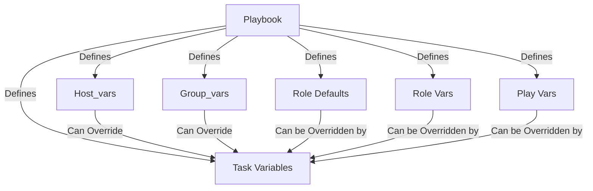

# Configuration Management

The following variable structure is used in this collection:

# Contributions
Contributions to this audio production workflow configuration project are welcome. If you encounter issues, have suggestions for improvements, or would like to add new features, please submit a pull request on our GitHub repository.

# License
This project is licensed under the MIT License. See the LICENSE file for more details.

# Acknowledgments
We would like to express our gratitude to the open-source community for developing and maintaining the FOSS applications used in this audio production workflow. Their dedication and contributions have been instrumental in creating a powerful and flexible environment for audio professionals.
